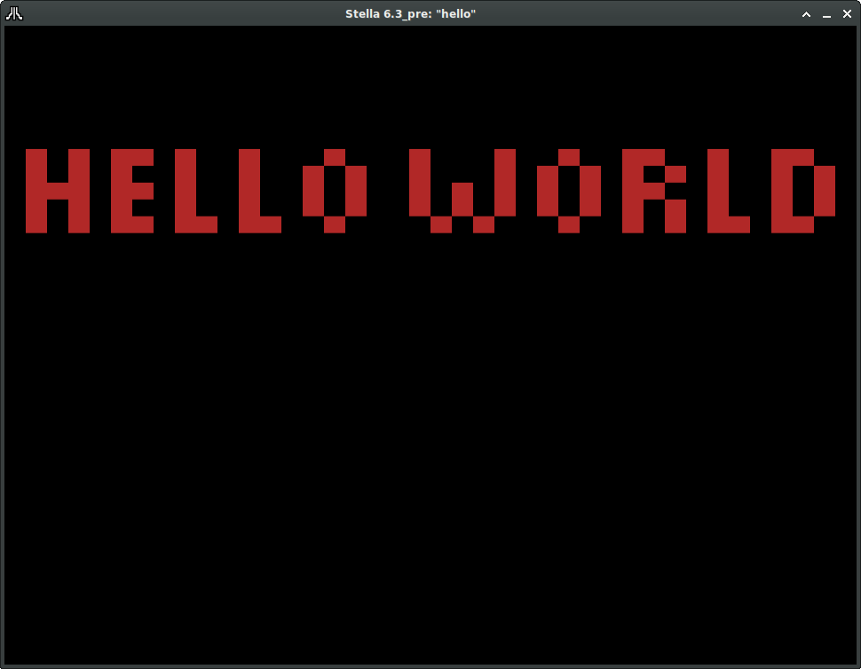

# vcs-hello
Hello World for Atari VCS/2600



To build, you need to install [cc65](https://github.com/cc65/cc65), with the
executables on your path.

Then run **build.sh** from bash, or just run the build directly on the command line:

```
cl65 -t atari2600 -o hello.bin -l hello.list hello.asm
```

You can then load hello.bin into the VCS/2600 emulator of your choice. It has been
tested on Linux using Stella. If you have an issue with any other emulator or
host environment, please post an issue to this repo. Thanks!
